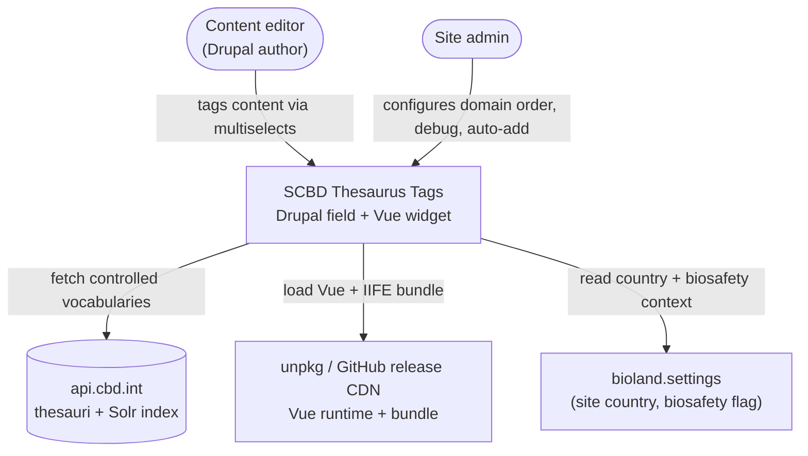
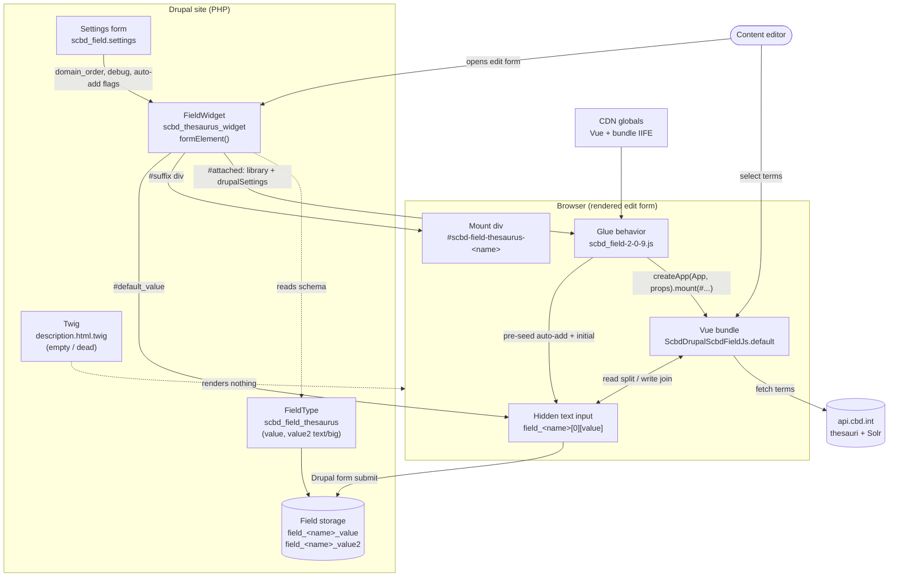
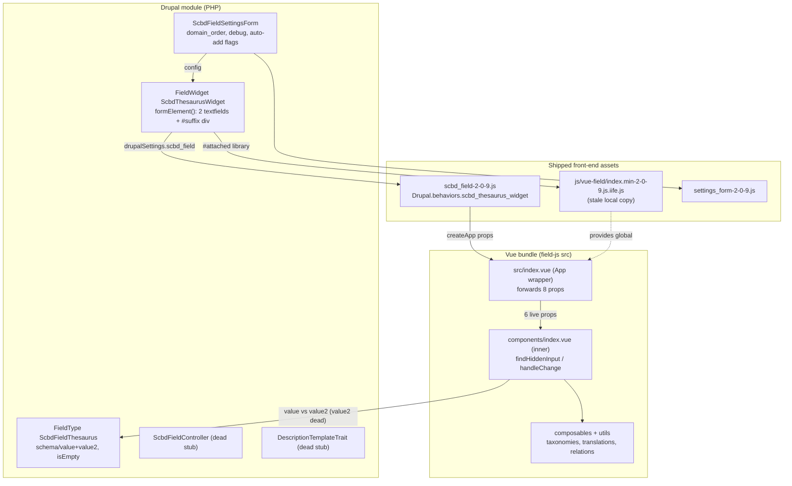
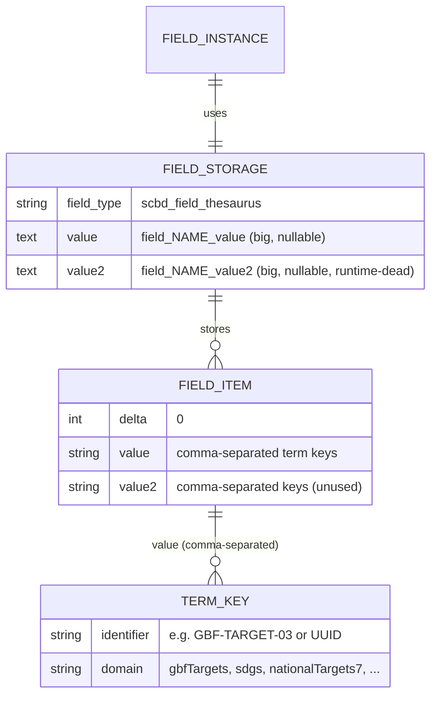
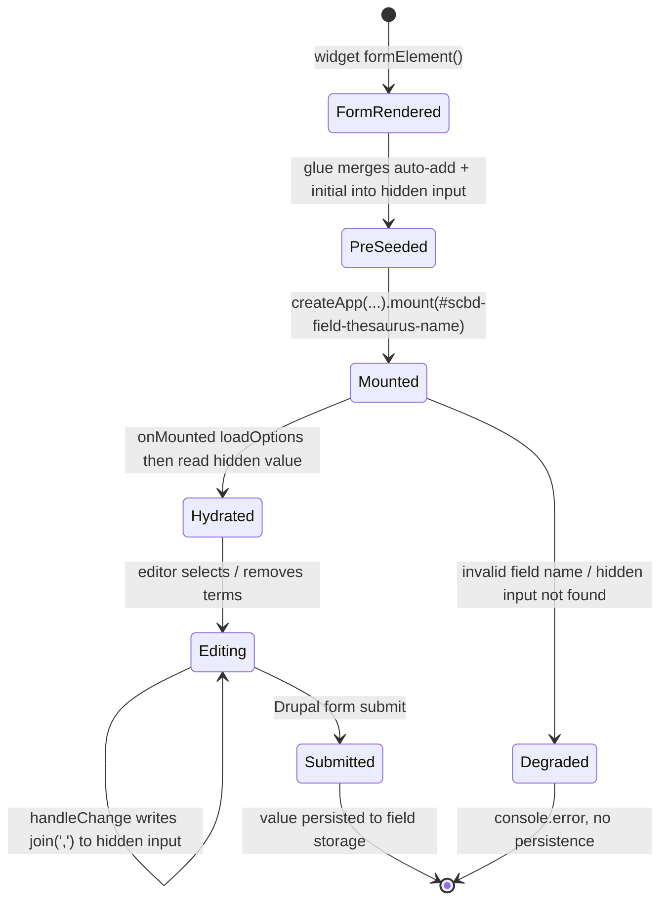
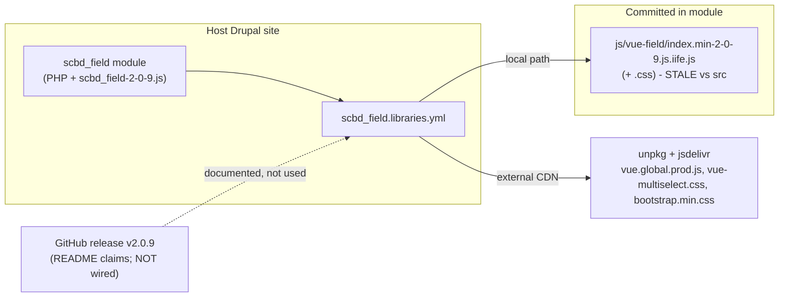

# SCBD Thesaurus Tags Architecture

> Living architecture overview of the **scbd_field** Drupal module (repo
> `drupal-module-scbd-thesaurus-tags`; the machine name in all code is `scbd_field`) and its
> runtime interface to the separate **scbd-field-js** Vue bundle repo. Update this file in place;
> bump `last-reviewed` on every edit. Glossary: [docs/CONTEXT.md](./CONTEXT.md).

## 1. Overview

`scbd_field` is a Drupal module that defines a custom field type (`scbd_field_thesaurus`), a widget (`scbd_thesaurus_widget`), and an admin settings form. The widget renders a set of multiselect dropdowns - one per "domain" (controlled vocabulary published on `api.cbd.int`: GBF targets, SDGs, national targets, countries, CBD/BCH subjects, IUCN ecosystem types, etc.) - by mounting a **Vue 3 IIFE bundle** (`drupal-module-scbd-field-js`) into a `<div>` the widget emits.

The two repos are joined by one thin **glue script** (`scbd_field-2-0-9.js`, a `Drupal.behaviors` attach) and one **shared DOM contract**: a hidden Drupal text input that holds a comma-separated list of term keys. The editor picks terms in Vue; Vue writes the keys back into that hidden input; Drupal submits and persists them.

**The decisive rule for this document:** the *module's actual runtime usage is the source of truth* for the interface. Where the bundle code or either README disagrees with what the module does at runtime, the module wins, the drift is recorded in §6, and the canonical contract is stated in §5.

## 2. System Context (C4 L1)



## 3. Containers (C4 L2)

The field crosses two runtimes: **Drupal/PHP** (form build + storage) and the **browser** (glue + Vue). The hidden input is the single state-bearing object both sides share.



Key facts (all verified against current code):

- **Mount target is a widget `#suffix`, not Twig.** `ScbdThesaurusWidget::formElement()` emits `<div id="scbd-field-thesaurus-{$field_name}">` as the `#suffix` of the `value` textfield (`src/Plugin/Field/FieldWidget/ScbdThesaurusWidget.php:114-115`). `templates/description.html.twig` is intentionally empty (lines 1-4) and renders nothing.
- **The hidden input *is* the Drupal `value` textfield.** It is rendered with class `edit-scbd_field-thesaurus` plus `hide` (unless debug) - name `field_<name>[0][value]`, id `edit-field-<name>-0-value` (`ScbdThesaurusWidget.php:107-137`). There is no separate `<input>` element and no template-emitted input.
- **Vue and the bundle are CDN/IIFE globals.** `scbd_field.libraries.yml` declares `scbd_field/vue` -> `unpkg vue.global.prod.js` (global `Vue`); the bundle is the IIFE global `ScbdDrupalScbdFieldJs`, consumed as `ScbdDrupalScbdFieldJs.default`. The glue errors out if either global is undefined (`scbd_field-2-0-9.js:121-130`).
- **The `scbd_field/vue` library also ships two CDN stylesheets alongside the Vue global** (`scbd_field.libraries.yml:9-12`): `vue-multiselect@3.2.0/dist/vue-multiselect.css` (unpkg) for the picker, and `bootstrap@5/dist/css/bootstrap.min.css` (jsdelivr) for the widget's layout/classes - so the widget pulls Vue runtime + vue-multiselect CSS + Bootstrap CSS from CDN, not just the Vue global.
- **One app per field; value2 is never its own app.** `isAdditionalField` is hardcoded `false` at `scbd_field-2-0-9.js:191`.

## 4. Key Components (C4 L3)



- **`ScbdFieldSettingsForm`** (`src/Form/ScbdFieldSettingsForm.php`) is the authoritative domain whitelist via `getDomainOptions()`: `gbfTargets, nationalTargets7, sdgs, countries, subjects, bchSubjects, bchSubjectGroups, regions, ecosystemTypes`. `validateForm` rejects any domain not in that list. Route is `scbd_field.settings` at **`/admin/config/content/scbd-field`** (`scbd_field.routing.yml`; menu parent `system.admin_config_content` in `scbd_field.links.menu.yml`).
- **Dead code (do not extend):** `ScbdFieldController` and `DescriptionTemplateTrait` are empty deprecated stubs; `description.html.twig` is empty. The entire description-template/controller subsystem described in older docs is dead.
- **`BiosafetyContext` helper is present but unwired.** `src/Utility/BiosafetyContext.php` exposes `isBiosafetyContext($is_biosafety_site, $domain_order)`, returning true on the site biosafety flag **or** when the configured domains include `bchSubjects` / `bchSubjectGroups`. It is covered by `tests/php/BiosafetyContextTest.php` but **no production code calls it** - `ScbdThesaurusWidget::formElement()` computes `$is_biosafety` inline from `bioland.settings` (`ScbdThesaurusWidget.php:43,76`) and gates Auto-add on the site flag only. So the helper's richer two-part definition is not what drives runtime Auto-add today. (ADR 0004 records the bioland-settings coupling.)
- **App wrapper vs inner component:** the bundle's App wrapper (`src/index.vue`) declares `singleValueDomains` with a default and **does** forward it to the inner `components/index.vue` along with `isAdditionalField, name, description, locale, locales, countries, domains, debug`. The gap is on the Drupal side: this module's glue (`scbd_field-2-0-9.js:181-193`) and PHP widget (`ScbdThesaurusWidget.php:118-131`) never supply `singleValueDomains`, so the App wrapper's own default applies and single-select membership stays a bundle constant, not configurable from Drupal.

## 5. Interface contract (source of truth)

> **Canonical statement.** The interface is whatever the module *does at runtime* - the glue's `createApp` call narrowed to the props the bundle actually declares, plus the hidden-input round-trip. This is **narrower** than both the glue's `createApp(...)` arguments and the bundle README's prop table. The bundle code is correct and current; the glue and both READMEs over-state the contract.

### 5.1 Mount contract

| Aspect | Value | Source |
| --- | --- | --- |
| Mount element | `#scbd-field-thesaurus-<name>` (`<name>` = field machine name, `field_` stripped, lowercased) | widget `:35,114`; glue `:88` |
| Mount call | `Vue.createApp(App, props).mount('#scbd-field-thesaurus-<name>')` | glue `:181-210` |
| Double-mount guard | `mountElement.__vue_app__ = true` | glue `:108` |
| Vue runtime | CDN global `Vue` (`scbd_field/vue` -> unpkg `vue.global.prod.js`) | libraries.yml; glue `:132` |
| Component bundle | IIFE global `ScbdDrupalScbdFieldJs.default` | glue `:127-133` |
| Apps per field | exactly one; `value2` never mounts its own app (`isAdditionalField:false` hardcoded) | glue `:191` |

The global name `ScbdDrupalScbdFieldJs` is set by `vite.config.js` `lib.name` - **not** derived from `package.json`. (`src/index.js` computes a separate `NAME` for the optional Vue-plugin registration only; it is never the IIFE global.) Verified identical in both the shipped `js/vue-field/index.min-2-0-9.js.iife.js` and a fresh `dist/index.min.js`.

### 5.2 Props the bundle actually consumes

| Prop | Passed by glue | Consumed by bundle | Status |
| --- | --- | --- | --- |
| `name` | yes | yes | **REQUIRED, load-bearing** - builds multiselect ids and the hidden-input selector `field_<name>[0][value]` (`components/index.vue:46,138`) |
| `description` | yes | yes | help text - set widget-side from `$element['#description']` (`ScbdThesaurusWidget.php:122`), passed by the glue (`scbd_field-2-0-9.js:62,75`), consumed at `components/index.vue:3` |
| `countries` | yes | yes | scopes `nationalTargets7` (`components/index.vue:102`) |
| `locale` | yes | yes | taxonomies + translations |
| `locales` | yes | yes | term-name fallback |
| `domains` | yes | yes | **load-bearing** - one multiselect per domain |
| `isAdditionalField` | yes (`false`) | yes | hardcoded `false`; its `value2` branch is **dead at runtime** |
| `debug` | **no** (read but not forwarded, glue `:63` vs `:181-193`) | yes | effectively always `false` in Drupal; the raw inputs are hidden by the `hide` CSS class instead (widget `:102-105`) |
| `fullFieldName` | yes | **no** | dropped by Vue; glue uses `full_field_name` only for its own pre-seed (glue `:162-178`) |
| `initialValue` | yes | **no** | dropped; bundle hydrates from the hidden input's `.value` (`components/index.vue:108-109`) |
| `initialValue2` | yes | **no** | dropped |
| `autoAddValues` | yes | **no** | dropped; the feature is realized by the glue pre-seeding the hidden input (glue `:143-178`) |
| `additionalFieldName` | yes | **no** | dropped; not even documented in the bundle README |
| `singleField` | no | no | **retired** - absent from current `src/`; only the stale shipped IIFE still carries it |
| `singleValueDomains` | no (glue never supplies it) | yes (App wrapper forwards it) | the App wrapper declares it with a default and forwards it to the inner component, but this module's Drupal glue never passes it, so the bundle's own default applies; **not configurable from Drupal** |

### 5.3 Hidden-input round-trip (the real state contract)

State of record is the single hidden Drupal `value` textfield: name `field_<name>[0][value]`, id `edit-field-<name>-0-value`. The value is a **comma-separated list of term keys** - read by `split(',')`, written by `join(',')`.

- **READ / hydrate:** `onMounted` -> `findHiddenInput()` (primary `input[name='field_<name>[0][value]']`, fallback `#edit-field-<name>-0-value`) -> `loadOptions()` -> `loadInitialValues()` does `hiddenInput.value.value.split(',').filter(Boolean)` then resolves each domain's saved keys to full term objects (`components/index.vue:108-132`).
- **WRITE / persist:** every `@select/@remove/@close` -> `handleChange()` sets `hiddenInput.value.value = getAllKeys().join()` (de-duped via `Set`) (`components/index.vue:143-186`).
- **GBF auto-link:** selecting a GBF target adds related SDGs + Subjects (one-way, add-only) from `GBF_SAMEAS`, then persists (`components/index.vue:152-175`, `utils/relations.js`).
- **Pre-seed (glue):** before mount, the glue merges `initial_value` + `auto_add_values` and writes the result into the hidden input via the `data-drupal-selector` (glue `:143-178`). So **auto-add and initial-value features are real and working - via the hidden input, not via props.**
- **Defensive degrade:** the field name is validated against `/^[a-z0-9_]+$/`; invalid -> `findHiddenInput()` returns `null` and the widget logs `console.error` instead of throwing (`components/index.vue:68-71,135-140,179-184`).

### 5.4 Persistence

Drupal saves the textfield's submitted value into the field type's `value` column. `scbd_field_thesaurus` (`src/Plugin/Field/FieldType/ScbdFieldThesaurus.php`) declares two `text/big` nullable columns `value` and `value2` (`:28-41`); storage-level columns are `field_<name>_value` / `field_<name>_value2` (confirmed by `scripts/diagnose-field-mismatch.php` and `scbd_field.install` update hooks). `isEmpty()` is true only when **both** columns are empty (`:47-55`).

### 5.5 Round-trip sequence

```mermaid
sequenceDiagram
  actor Editor
  participant Widget as FieldWidget (PHP)
  participant DOM as Hidden input + mount div
  participant Glue as scbd_field-2-0-9.js
  participant Vue as Vue bundle
  participant API as api.cbd.int
  participant DB as Field storage

  Note over Widget,DOM: Edit form load
  Widget->>DOM: render value textfield (name field_&lt;name&gt;[0][value])
  Widget->>DOM: render mount div #scbd-field-thesaurus-&lt;name&gt;
  Widget->>Glue: #attached drupalSettings.scbd_field + library

  Note over Glue,DOM: Pre-mount hydration (glue)
  Glue->>Glue: merge initial_value + auto_add_values
  Glue->>DOM: write merged value into hidden input

  Note over Glue,Vue: Mount
  Glue->>Vue: createApp(App, props).mount(#scbd-field-thesaurus-&lt;name&gt;)

  Note over Vue,API: Bundle hydration (onMounted)
  Vue->>DOM: findHiddenInput() input[name=field_&lt;name&gt;[0][value]]
  Vue->>API: loadOptions() fetch thesauri / Solr
  API-->>Vue: domain terms
  Vue->>DOM: read hidden value, split(',')
  Vue->>Vue: resolve saved keys to term objects

  Note over Editor,Vue: User edits
  Editor->>Vue: select / remove term
  Vue->>Vue: auto-link GBF to SDGs + Subjects
  Vue->>DOM: hidden.value = getAllKeys().join(',')

  Note over Editor,DB: Save
  Editor->>DOM: submit Drupal form
  DOM->>Widget: POST field_&lt;name&gt;[0][value]
  Widget->>DB: store value (and value2) columns
```

## 6. Drift & reconciliation

The working hypothesis ("the bundle code is right and the glue/module docs need updating") holds, but the drift is wider than a stale README: the **glue** still passes props the bundle ignores, and the module ships a **stale local bundle** that lags the bundle `src/`. Two features the props surface implies are live (auto-add, initial value) are in fact real and working, just implemented module/glue-side via hidden-input pre-seeding, so the accurate framing is *the mechanism is hidden-input pre-seeding, not props, and the features themselves exist.*

The table below records only drift that is verifiable from THIS repo: this module's actual runtime behavior (per its glue, widget, libraries, routing, and PHP) and the shipped-artifact-versus-source gap. It deliberately does **not** restate what the separate scbd-field-js bundle README currently says, because that lives outside this repo and drifts independently; claims about the sibling repo's prop declarations are noted as needing verification there rather than asserted here.

| Item | Reality (this module's code) | Resolution |
| --- | --- | --- |
| `initialValue` / `initialValue2` | passed by the glue (`scbd_field-2-0-9.js:189-190`); initial state actually flows through the hidden input, which the glue pre-seeds before mount (glue `:143-178`) | initial state flows ONLY through the hidden input; the props are no-ops on the bundle |
| `fullFieldName` | passed by the glue (`scbd_field-2-0-9.js:183`) but used only for the glue's own pre-mount hidden-field sync (glue `:162-178`) | glue-internal concern; not part of the contract the bundle consumes |
| `autoAddValues` | read by the glue (`scbd_field-2-0-9.js:66`) and merged into the hidden input pre-mount (glue `:143-178`); not passed as a prop | module/glue responsibility executed before mount; the bundle just reads the result |
| `additionalFieldName` | passed by the glue (`scbd_field-2-0-9.js:192`) | not part of the contract; drop from the glue |
| `singleField` | absent from the glue and PHP; still present in the stale shipped IIFE (8 occurrences in `js/vue-field/index.min-2-0-9.js.iife.js`) | retired; "single fields" now means single-value domains, one-per-widget |
| `singleValueDomains` | never supplied by the glue (`scbd_field-2-0-9.js:181-193`) or the PHP widget (`ScbdThesaurusWidget.php:118-131`), so the bundle's own default applies | currently a fixed bundle default, NOT configurable from Drupal |
| `debug` | read by the glue (`scbd_field-2-0-9.js:63`) but never forwarded into `createApp` (glue `:181-193`); raw-input visibility is driven by the module's `hide` CSS class (widget `:103-105`) | to make the bundle's debug UI reachable in Drupal the glue must forward `debug`; today it is hidden behind the CSS class only |
| `value2` / `isAdditionalField` | the storage column, widget element, and glue all exist, but no app ever mounts with `isAdditionalField:true` (hardcoded `false`, glue `:191`) | runtime-dead; install hooks 9008+ exist solely to backfill the `value2` column |
| Library delivery | `scbd_field.libraries.yml` loads a LOCAL, STALE `js/vue-field/index.min-2-0-9.js.iife.js` | pick one delivery mechanism and re-sync the shipped IIFE to the current bundle `src/` |
| Settings route | `/admin/config/content/scbd-field` (`scbd_field.routing.yml:3`) | canonical path includes `/content` |
| **This module's `README.md`** | describes an autocomplete/typeahead widget, a "remote thesaurus API base URL" setting, a live `description.html.twig`, and `scbd_field.js` / `index.min.js` artifacts (README.md), none of which exist: the widget mounts the Vue bundle (no typeahead in PHP), there is no API-URL setting (only `debug`, the auto-add toggles, and `domain_order`), the Twig template is empty, and the shipped script is `scbd_field-2-0-9.js` | this module's README predates the current architecture and should be rewritten from this file plus the PRD |

> **Scope note:** rewriting this module's README and trimming the glue are *deliberately deferred*. This document records the truth; it does not change source.

## 7. Data Model



Term keys are slugs (e.g. `GBF-TARGET-03`, `SUSTAINABLE-DEVELOPMENT-GOAL-06`) except national targets, which are UUIDs. Legacy `SDG-GOAL-*` keys are read and rewritten to `SUSTAINABLE-DEVELOPMENT-GOAL-*` on next save.

## 8. State Machine (widget lifecycle)



## 9. Deployment / Library wiring



Today the module loads the bundle from a **local committed copy** (`js/vue-field/index.min-2-0-9.js.iife.js`), while the bundle README documents loading from GitHub release URLs. These disagree, and the local copy is older than `src/` (see §6).

## 10. Quality Attributes (NFRs)

| Attribute | Target | How the architecture meets it |
| --- | --- | --- |
| Correctness of state | No data loss across reload/save | Single source of state is the hidden Drupal input; bundle always re-reads it on mount and re-writes it on every change. `isEmpty()` keyed on both columns so a value-only field is never wrongly dropped. |
| Robustness | Malformed config never throws in the editor | Field name validated `/^[a-z0-9_]+$/`; missing input degrades to `console.error` rather than throwing (`components/index.vue:68-71,179-184`). Glue guards Vue/bundle globals and double-mount. |
| Performance | Fast first paint, no redundant fetches | Per-domain flags precomputed; hidden input resolved once at mount; `loadOptions()` fetches domains in parallel; saved national-target options reused without refetch (`components/index.vue:78-105,123`). |
| Internationalization | Labels in 60+ languages | `locale` -> `en` -> raw-key fallback; only requested locales loaded lazily (`composables/use-translations`). |
| Configurability | Admin controls which domains render and order | `domain_order` (settings form) -> `domains` prop, validated against `getDomainOptions()` whitelist. (Single-select set is currently NOT admin-configurable - see §6.) |
| Maintainability | Clear seam between Drupal and Vue | One DOM contract (hidden input) + one mount selector; PHP owns storage/auto-add, Vue owns the picker. Drift is the main risk (§6, §11). |
| Security | No injection via field name | Field name is validated before building any `querySelector`; only `[a-z0-9_]` permitted. |

## 11. Architecture Decisions

The ADR practice is initialized; see [`docs/adr/`](./adr/). Decisions governing this architecture:

- [0001](./adr/0001-record-architecture-decisions.md) - record architecture decisions in `docs/adr/`.
- [0002](./adr/0002-persist-stable-term-keys.md) - persist stable Term keys, not Labels (the data-model rule behind §7 and the value round-trip).
- [0003](./adr/0003-vue-bundle-mounted-in-widget.md) - render the picker as a Vue bundle mounted into the Drupal widget (the container split in §3 and the hidden-input contract in §5).
- [0004](./adr/0004-derive-site-context-from-bioland-settings.md) - derive country + biosafety context from `bioland.settings` (the coupling in §2 and the Auto-add path in §5).

Two decisions implied by the contract are not yet their own ADRs because they are facets of 0003 rather than standalone trade-offs: Auto-add is executed glue-side (the glue merges `GBF-TARGET-17` and the site country into the hidden input before mount, not via a bundle prop), and the combined-field `singleField` mode is retired (single-value domains now render one per widget). Record either as a new ADR only if it is revisited as a real decision.

## 12. Risks & Open Questions

- **value2 is latent.** Storage column, widget element, bundle code, and install backfill hooks (9008+) all exist, but no app ever mounts with `isAdditionalField:true`. Decide: wire a second mount, or remove value2 + its backfill + widget element.
- **Stale shipped bundle.** `js/vue-field/index.min-2-0-9.js.iife.js` lags `src/` (still carries `singleField`). The shipped IIFE must be re-synced to current `src/`, and one delivery mechanism (local artifact vs GitHub release) chosen.
- **Glue over-passes props.** `fullFieldName, initialValue, initialValue2, autoAddValues, additionalFieldName` are dropped by Vue; the glue can be trimmed once docs are reconciled (deferred).
- **`debug` unreachable in Drupal.** The glue never forwards it; decide whether to wire it or document debug as dev-harness-only.
- **`singleValueDomains` not admin-configurable.** The App wrapper already forwards it; the Drupal side just never supplies it. Either have the glue/widget pass it via a new drupalSetting, or document it as a build-time bundle constant.
- **Combined-field (`singleField`) removal safety.** Confirm no deployed site config relies on the old combined widget before deleting it from `src/`.
- **Dead stubs.** `ScbdFieldController`, `DescriptionTemplateTrait`, empty `description.html.twig` - safe to delete only after confirming no stale cached routes reference them on any environment.
